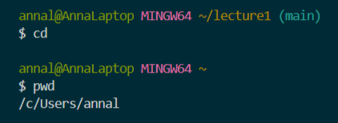
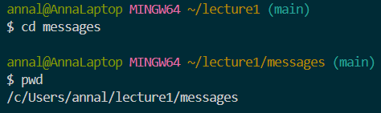
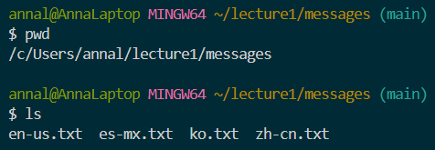
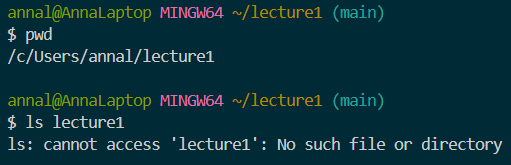
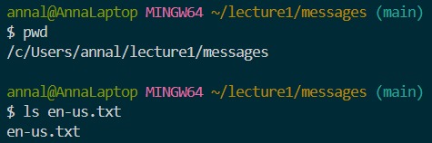
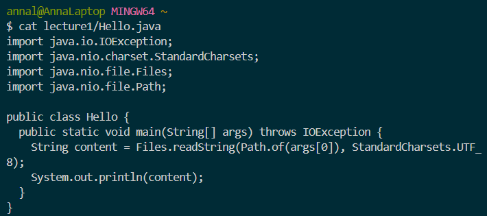
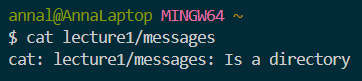

# Lab Report 1

## For the command `cd`: 
1. Using the command with *no* arguments:
 
     
   
     Absolute path before running the command: /c/Users/annal/lecture1  

2. Using the command with a path to a *directory* as an argument:

     

     Absolute path before running the command: /c/Users/annal/lecture1

3. Using the command with a path to a *file* as an argument:

     

     Absolute path before running the command: /c/Users/annal/lecture1/messages

## For the command `ls`:
1. Using the command with *no* arguments:

     

     Absolute path before running the command: /c/Users/annal/lecture1/messages

2. Using the command with a path to a *directory* as an argument:

     

     Absolute path before running the command: /c/Users/annal/lecture1

3. Using the command with a path to a *file* as an argument:

     

     Absolute path before running the command: /c/Users/annal/lecture1/messages 

## For the command `cat`: 
1. Using the command with *no* arguments:

     

     Absolute path before running the command: /c/Users/annal/lecture1/messages

2. Using the command with a path to a *directory* as an argument:

     

     Absolute path before running the command: /c/Users/annal

3. Using the command with a path to a *file* as an argument:

     

     Absolute path before running the command: /c/Users/annal

