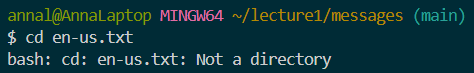
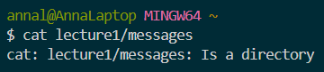

# Lab Report 1

## For the command `cd`: 
1. Using the command with *no* arguments:
 
     
   
     Absolute path before running the command: `/c/Users/annal/lecture1`

     Running `cd` with no argument changed the current working directory to `/c/Users/annal`. In other words, it changed the current working directory to the parent directory of the current directory.
   This is not an error, it is just the default outcome of running `cd` without providing a path as an argument. 

2. Using the command with a path to a *directory* as an argument:

     

     Absolute path before running the command: `/c/Users/annal/lecture1`

     Running `cd` to the directory `messages` (using a relative path) changed the current working directory to `messages` (or to the path `/c/Users/annal/lecture1/messages`). This is not an error.

3. Using the command with a path to a *file* as an argument:

     

     Absolute path before running the command: `/c/Users/annal/lecture1/messages`

     Running `cd` with the file `en-us.txt` as a path gives an error. This is because `cd` changes the current working directory to the given path, but a file is not a directory, so it doesn't work.

## For the command `ls`:
1. Using the command with *no* arguments:

     

     Absolute path before running the command: `/c/Users/annal/lecture1/messages`

     Running `ls` without an argument listed the contents of the messages folder. This is because no argument defaults to listing the contents of the current working directory, which in this case was `/c/Users/annal/lecture1/messages` (not an error). 

2. Using the command with a path to a *directory* as an argument:

     

     Absolute path before running the command: `/c/Users/annal/lecture1`

     Running `ls lecture1` gives an error. This is because `lecture1` is a relative path, and there is no `lecture1` in the `lecture1` folder (which is the current working directory). However, running `/c/Users/annal/lecture1` would give no error, and it would list the contents of the `lecture1` folder. 

3. Using the command with a path to a *file* as an argument:

     

     Absolute path before running the command: `/c/Users/annal/lecture1/messages`

     Running `ls en-us.txt` outputs `en-us.txt`. This is not an error, it is because the contents of `en-us.txt` is itself (it does not contain any files or folders besides itself). 

## For the command `cat`: 
1. Using the command with *no* arguments:

     

     Absolute path before running the command: `/c/Users/annal/lecture1/messages`

     Running `cat` with no arguments does nothing; the system waits for an argument to be inputted or for the user to end the command. This is not an error (it just doesn't do anything). However, inputting text after running cat without an argument returns the same text:

     

     As displayed above, when I input "hello" it returns "hello," and when I input "hi" it returns "hi."

3. Using the command with a path to a *directory* as an argument:

     

     Absolute path before running the command: `/c/Users/annal`

     Running `cat lecture1/messages` returns the message above. `cat` is used to print the contents of one or more files as indicated by the given paths, but since there are no files indicated (only a directory) `cat` essentially does nothing (this is not an error, it just tells the user that it is a being called on a directory). 

4. Using the command with a path to a *file* as an argument:

     

     Absolute path before running the command: `/c/Users/annal`

     Running `cat lecture1/Hello.java` prints the contents of the `Hello.java` file, as expected. There are no errors. 

