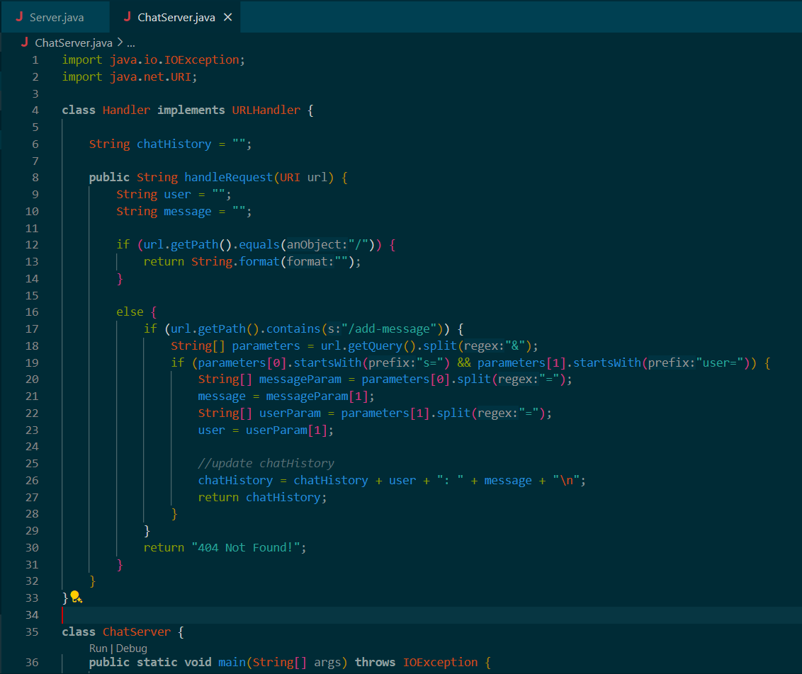
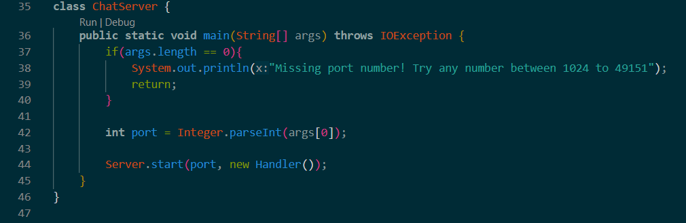
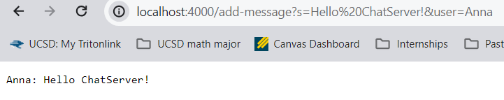
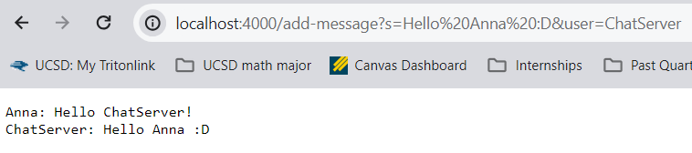
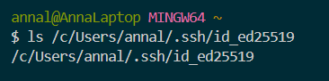
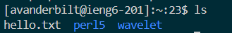
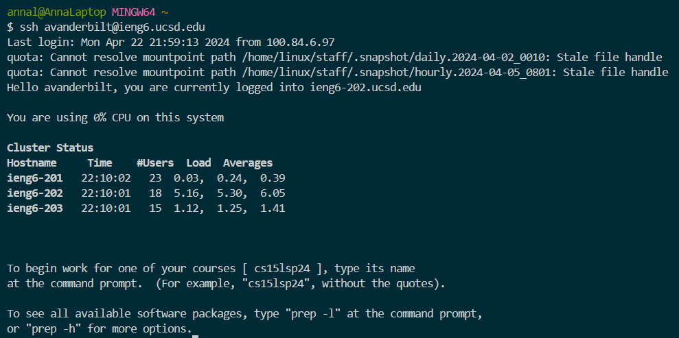

# Lab Report 2

## Part 1

`ChatServer` code: 

  
  

Using `add-message`:

  

- The `handleRequest(URI url)` method is called.
- The relevant argument is the url of the server (`http://localhost:4000/add-message?s=Hello ChatServer!&user=Anna`), and the class field `chatHistory` is initialized as an empty String.
- After the first `add-message`, `chatHistory` is updated to `Anna: Hello ChatServer!` with a newline.

  

- The `handleRequest(URI url)` method is called again.
- The relevant argument is again the url of the server (this time `http://localhost:4000/add-message?s=Hello Anna :D&user=ChatServer`), but now the class field `chatHistory` is the updated String (`Anna: Hello ChatServer!` plus a newline).
- After the second `add-message`, `chatHistory` is updated to display `ChatServer: Hello Anna :D` after the previous line. 

## Part 2 

1. Running `ls` with the absolute path to my private key:

   

2. Running `ls` with the absolute path to my public key from the `ieng6` machine:

   

3. Logging into my `ieng6` account without being asked for my password:

   

## Part 3 

Basically everything I've learned in the past few weeks in CSE 15L has been something I didn't know before, but a couple things that stood out is how to create a local server and how to join a remote server. I had no idea that there were remote UCSD servers that anyone could log into so easily, and I think it's very cool that we can use just a few simple commands (`ssh`, `scp`, etc.) to copy our own local files to a remote server on an `ieng6` machine. 
   
