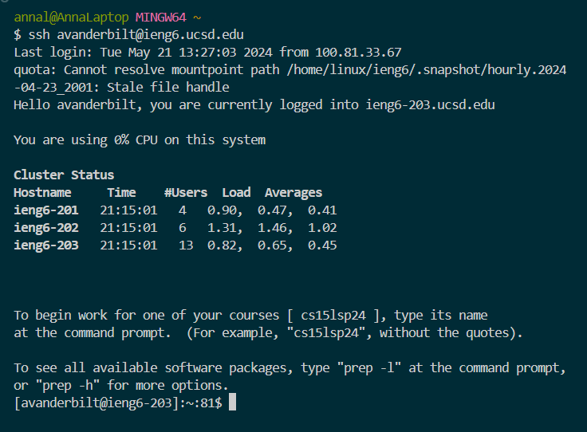
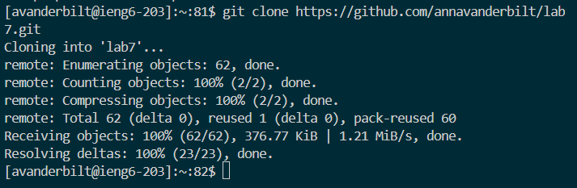
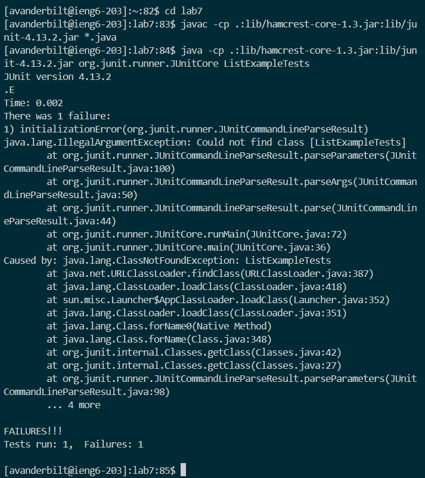
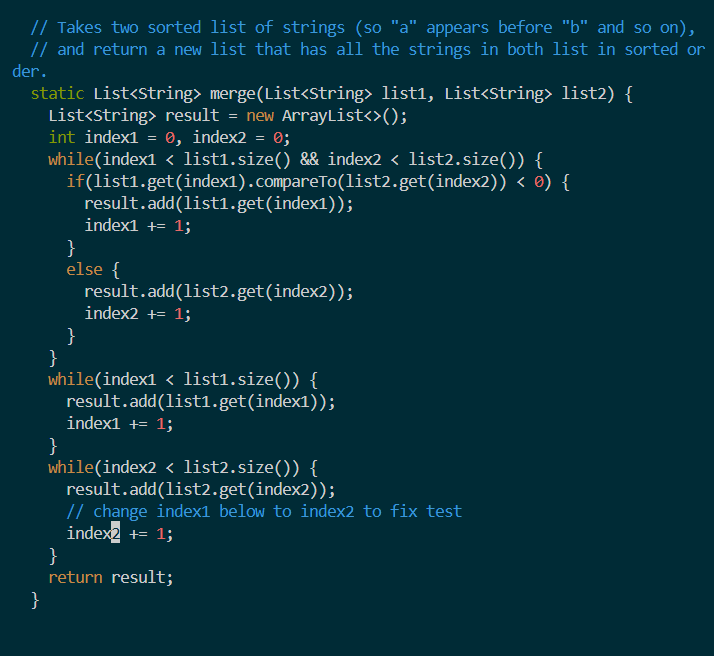
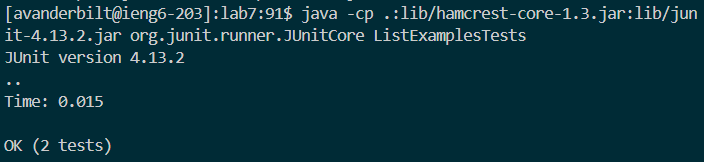
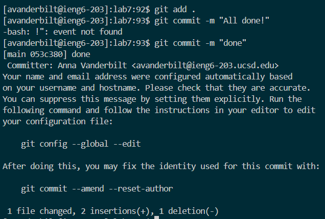

# Lab Report 4

## Step 4

Logging into ieng6:

Keys pressed/commands run: `ssh avanderbilt@ieng6.ucsd.edu`

I used `ssh` to log into the remote `ieng6` server. 

## Step 5

Cloning the repository fork:

Keys pressed/commands run: `git clone https://github.com/annavanderbilt/lab7.git`

I used the `git clone` command to clone the lab 7 forked repository onto the remote server. 

## Step 6

Running the tests:

Keys pressed/commands run: `cd lab7`, used CTRL+C CTRL+V for `javac -cp .:lib/hamcrest-core-1.3.jar:lib/junit-4.13.2.jar *.java` and `java -cp .:lib/hamcrest-core-1.3.jar:lib/junit-4.13.2.jar org.junit.runner.JUnitCore ListExamplesTests`

I changed my current directory to `lab7`, compiled the files, and ran `ListExamplesTests`. As shown above, one test failed.

## Step 7

Fixing the failing test:

Keys pressed/commands run: `ls <enter>`, `vim ListExamples.java`, `i`, clicked on the space before `index2`, `<backspace> 2 <esc> :wq`

I used `vim` to view the `ListExamples` code, then changed `index1` to `index2` to fix the error. I then exited inserting mode and saved the code.

## Step 8

Running the tests again:

Keys pressed/commands run: `<up><up><up><up><enter>`, `<up><up><up><up><enter>'

I navigated back up to the previous `javac` and `java` commands to recompile and run `ListExamplesTests`. As shown above, all the tests now pass.

## Step 9

Committing and pushing the result:

Keys pressed/commands run: `git add .`, ` git commit -m "done"`, `git push`

I saved the changes I made to `lab7` and pushed the changes to the github forked repository. 

