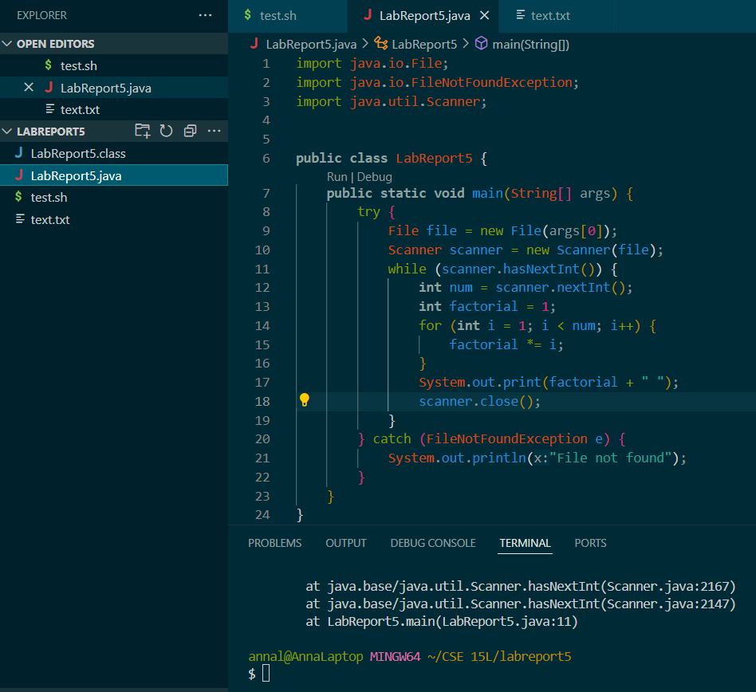
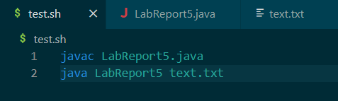
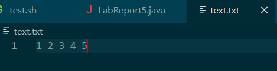
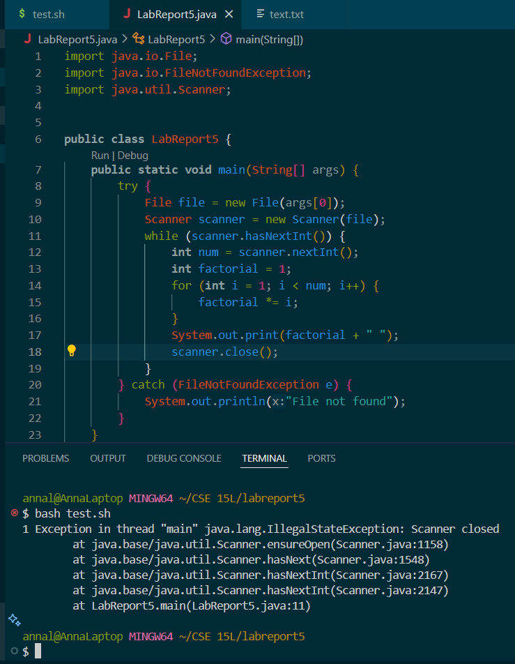

# Lab Report 5

## Part 1 - Debugging Scenario

For this lab report, I designed a Java script that takes a text file with some numbers in it and prints out the factorial of each of those numbers. It has some errors that will be fixed at the end of the Piazza debugging scenario.

This is the file/directory structure:

```
labreport5/
|-- LabReport5.java
|-- test.sh
|-- text.txt
```

This is `LabReport5.java`, `test.sh`, and `text.txt` (before the errors are fixed):



                   


***

Here is the Piazza Debugging Scenario:

**Post Title**: Factorial Calculator Not Working

**Student**: Hello, I am having some issues running my factorial calculator code. When I run `bash test.sh`, the terminal gives me an `IllegalStateException`. I'm not really sure what the issue is, could you help me figure out what's wrong with it? Here is my code and the terminal output:



                   

**TA Response**: Hi! It looks like `scanner` is closing because your code tells it to in line 18. It is fine to close `scanner`, but you are doing it inside the while loop when you should be closing it right after the while loop. Since it is closing inside the while loop, after the first iteration when it checks `scanner.hasNextInt()`, it gives an error because it can't do this while `scanner` is closed. So to fix this, just move your code in line 18 to right outside the while loop.

**Student Response**: Thank you so much! I fixed this and this error is no longer showing up. Unfortunately, it seems like there is still something wrong with my code. The file seems to be reading properly, but it is printing out the wrong numbers (for the numbers `1, 2, 3, 4, 5`, the factorial output should be `1, 2, 6, 24, 120`). I'm not sure what's wrong with it, could you help me? Here is my code again and the output:

